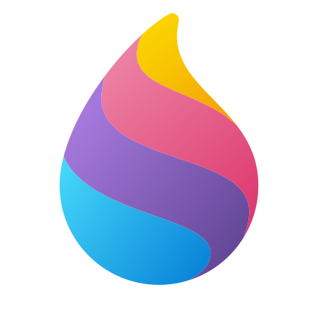
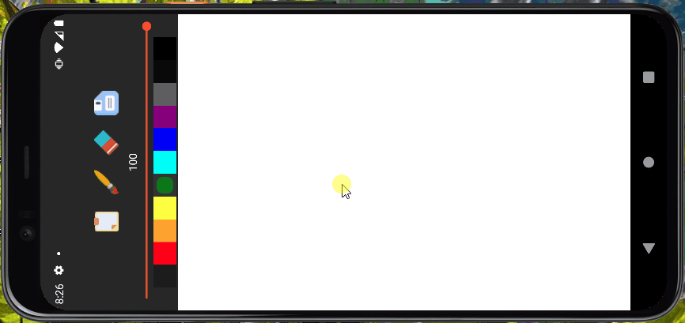

	<h1>Paint</h1>
  	

<h2>Information</h1>

Raint is an android application for drawing. It contains brushes with choice of thickness, colors and translucency, an eraser and saving functionality. 

  
   

 
	
<b> 🐸 FROGGED </b>
